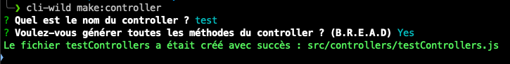
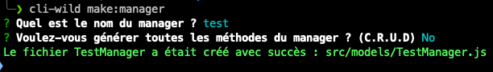

<h1 align="center">Bienvenue sur cli-wild 👋</h1>
<p>
  
  <a href="https://github.com/GorskiAnthony/wcs-cli#readme" target="_blank">
    
  </a>
  <a href="https://github.com/GorskiAnthony/wcs-cli/graphs/commit-activity" target="_blank">
    
  </a>
  <a href="https://twitter.com/Gorski_anthony" target="_blank">
    
  </a>
</p>

> Ce package permet de générer des controllers ainsi que des models pour votre backend via la CLI.

### 🏠 [Homepage](https://github.com/GorskiAnthony/wcs-cli#readme)

## Install

```sh
npm install -g cli-wild
```

## Liste des commandes

```sh
cli-wild make:controller # Créer un controller
cli-wild make:manager # Créer un model
cli-wild make:abstract # Créer un model abstrait
```

## Usage

Il faut se déplacer à la racine de votre projet (`backend`) et lancer la commande suivante :

```sh
cli-wild make:controller
# OU
npx cli-wild make:controller
```

Celui-ci va vous poser des questions afin de générer le controller & votre manager.





## Exemples

Pour plus d'exemples, il faut se rendre dans le dossier [examples](./examples) du repository.

## Auteur

👤 **Anthony Gorski**

-   𝕏 - (Twitter): [@Gorski_Anthony](https://twitter.com/Gorski_Anthony)
-   GitHub: [@GorskiAnthony](https://github.com/GorskiAnthony)

## 🤝 Contributing

Les contributions, les problèmes et les demandes de fonctionnalités sont les bienvenus !<br />N'hésitez pas à consulter la page des [issues](https://github.com/GorskiAnthony/wcs-cli/issues).

## Affichez votre soutien

Donnez un ⭐️ si ce projet vous a aidé !

## 📝 License

Copyright © 2023 [Anthony gorski](https://github.com/GorskiAnthony).<br />
This project is [ISC](https://github.com/GorskiAnthony/wcs-cli/blob/master/LICENSE) licensed.

---

### 🗃️ Version

-   **v1.0.0** - Version 1 stable de la CLI `cli-wild`
-   **v1.1.0** - Ajout des questions pour la création d'un controller
-   **v1.2.0** - Ajout d'un prompt pour la création d'une classe abstraite

---

### 👋 Qui suis-je ?

Je suis **Anthony Gorski**, développeur web et formateur à la [Wild Code School](https://www.wildcodeschool.com/fr-FR).
